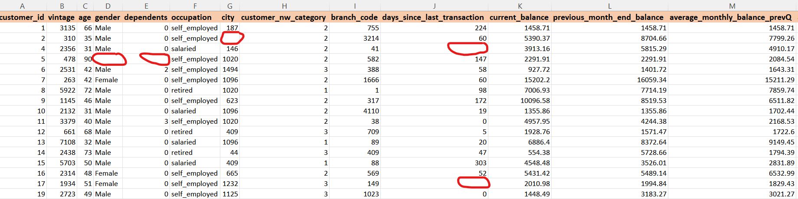
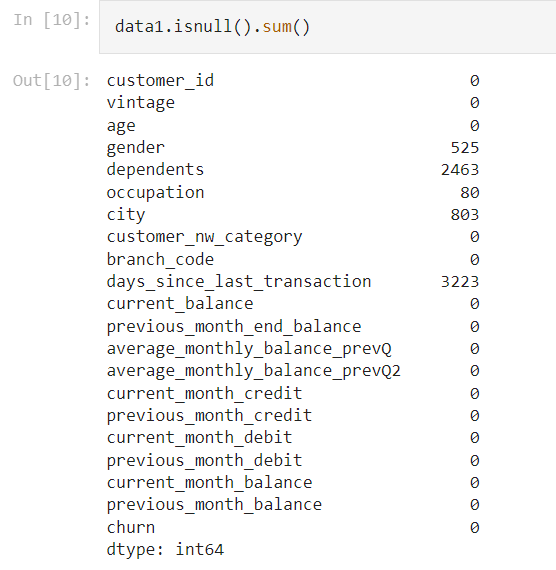
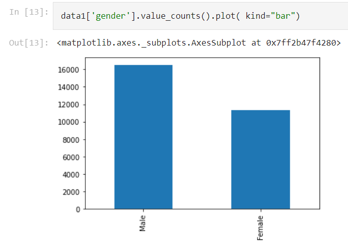
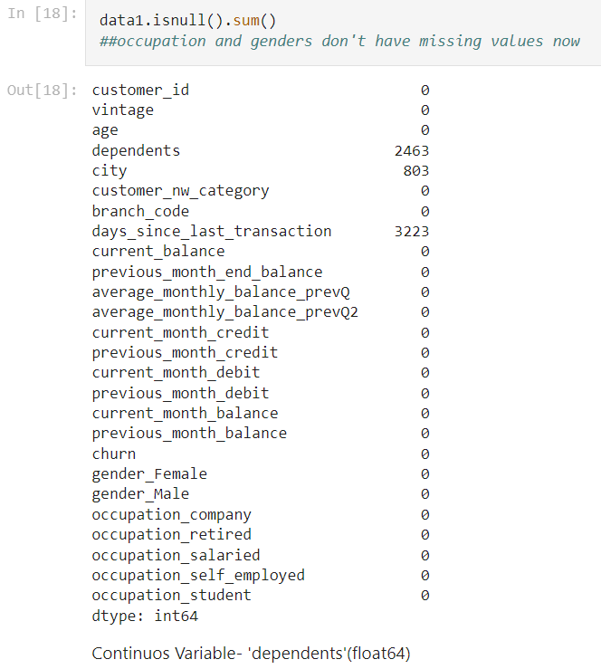

# [Customer_Churn_Prediction_ML_Portfolio](https://github.com/Vibhor2256/Customer-Churn-Prediction_ML)

This is a repository/portfolio for project created named "Customer Churn Prediction". This project involved functionalities like 'data cleaning', 'data transformation', 'data analysis', 'prediction', etc.

* The problem statement said that "A Bank wants to take care of customer retention for its product: savings accounts." The provided dataset was having Demographic information about customers, Customer Bank Relationship and finally Transactional Informations. 
* Data set were having a lot of missing values, NULL values, etc. So various data cleaning methods were used to clean the data first. Below are some snapshots for the dataset:   

* Data Analysis and Data Preprocessing was needed for the dataset inorder to make it trainable for the algorithm. Refer below snapshots showcasing such instances:- 
 
    Below is one such example where the missing values were removed using 'One Hot Encoding'.          The Null values from 'gender' and 'occupation' are removed now after data preprocessing-  

* Seperated independent, dependent variables & splitted them into training and testing set so as to use the dataset for training the algorithms for the inherent behaviour of the dataset. Finally algorithms were tested on the testing part of the dataset for the prediction as well as accuracy scores and confusion matrix.
* Algorithms used for the churn predictions were 'Logistic Regression', 'KNN Classifier', 'Decision Tree Classifier', 'Random Forest Classifier' and 'ANN classifier'. Below table compares the prediction of these algorithms on the basis of accuracy_score:-    
| Models | Accuracy_Score |
| ----------- | ----------- |
| Logistic Regression | 0.8252536640360767 |
| KNN | 0.8485062006764374 |
| Decision Tree | 0.8458286358511837 |
| Random Forest | 0.8607666290868095 |
| ANN | 0.8679537767756482 |

| Syntax | Description |
| ----------- | ----------- |
| Header | Title |
| Paragraph | Text |
