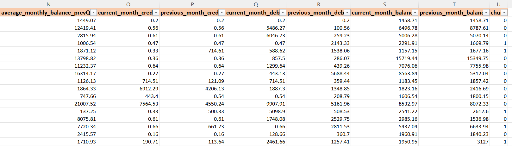
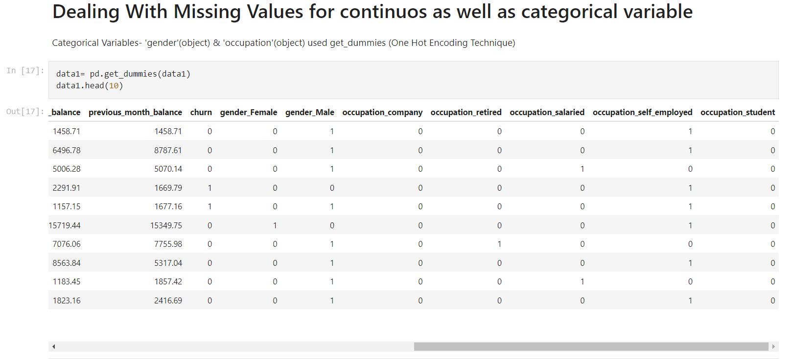

# [Customer_Churn_Prediction_ML_Portfolio](https://github.com/Vibhor2256/Customer-Churn-Prediction_ML)

This is a repository/portfolio for project created named "Customer Churn Prediction". This project involved functionalities like 'data cleaning', 'data transformation', 'data analysis', 'prediction', etc.

* The problem statement said that "A Bank wants to take care of customer retention for its product: savings accounts." The provided dataset was having Demographic information about customers, Customer Bank Relationship and finally Transactional Informations. 
* Data set were having a lot of missing values, NULL values, etc. So various data cleaning methods were used to clean the data first. Below are some snapshots for the dataset: 

* Data Analysis and Data Preprocessing was needed for the dataset inorder to make it trainable for the algorithm. Refer below snapshots showcasing such instances:-  
 
 Here is one such example where the missing values were removed using 'One Hot Encoding'.            The Null values from 'gender' and 'occupation' are removed now after data preprocessing- 

*

